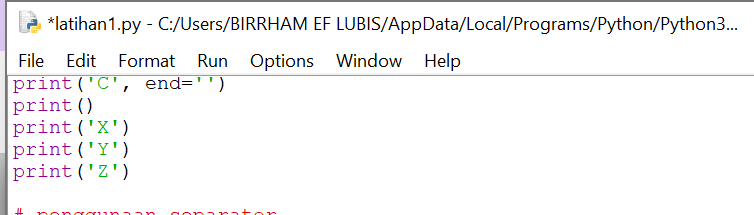

# Praktikum 3

## Latihan 1

### Penggunaan End

#### -Penggunaan end pada Python berfunngsi untuk memberi pemisah antara quotes yang kita buat

.png)

### Penggunaan Separator

#### -penggunaan separator pada python berfungsi sebagai pemisah dari setiap variabel yang telah di beri nilai

.png)

### String Format

#### -String Formatting memungkingkan kita untuk memberikan item kedalam string daripada kita mencoba menggabungkan string menggunakan koma atau striing concatenation

.png)

#### -ini contoh string concatenation

.png)

## Latihan 2

#### -Tentukan dahulu variabel yang akan di gunakan, misalnya a dan b

#### -Beri inputan pada variabel 

#### -Setelah diberi input, ekdpresikan variabel yang telah diberi inputan 

#### -Lalu gabungkan variabel a dan bdengan  Formatting String

### Konversi nilai Variabel 

#### -Konversi nilai variabel yang masih berbentuk 'string' pada 'integer'

### -Setelah itu menjumlahkan dan membagi dengan ekspresikan dalam bentuk Formatting String

.png)

## Latihan 3

### Buatlah kode program menggunakan string formatting untuk menghasilkan output seperti gambar dibawah ini

 #### string =""
 #### x = int(input("Masukkan angka :"))
 #### a = x
 #### while a >= 0:
    b = a
    while b > 0:
        #### string = string + "   "
        b = b - 1
    l = 1
    while l < (x - (a-1)):
        string = string + " * "
        l = l + 1
    r = 1
    while r < l -1:
        string = string + " * "
        r = r + 1
    string = string + "\n\n"
    a = a -1
 #### a = 1
 #### while a <= x:
    b = a + 1
    while b > 1:
        string = string + "   "
        b = b -1
    l = 0
    while l < (x - a):
        string = string + " * "
        l = l + 1
    r = l
    while r > 1:
        string = string + " * "
        r = r - 1
    string = string + "\n\n"
    a = a + 1
print(string)

#### -agar menampilkan output yang sama dengan contoh di atas, yaitu dengan menjalankan hasil daari statement yang telah dibuat lalu kita inputkan numeric 5

# Praktikum 3

#### -Program diatas saya mengimport modul math yang sudah di sediakan oleh python. Fungsinya supaya saya dapat menyertakan nilai phi yang sudah tersedia dalam modul tersebut dengan perintah math.pi jika kita coba mencetak fungsi tersebut maka akan menghasilkan nilai 3.14

#### -Selanjutnya kita memerlukan nilai jari-jari (r) yang nantinya akan di masukan oleh pengguna pada layar. Kita menggunakan fungsi input() yang nilainya di konversi ke tipe data float 

#### -Ketika kita sudah mendapat nilai phi dan jari-jari selanjutnya kita bisa menghitung luas dan keliling sesuai dengan rumus-nya masing-masing (lihat pada baris ke 3 & 4).

#### -Selanjutnya kita tampilkan hasilnya dengan fungsi print(). sintak \t merupakan karakter espace yang berfungsi untuk membuat tab. dalam kasus ini agar sejajar karakter sama dengan (=) nya

#### -Jika dilihat hasil luas dan keliling lingkaran mempunyai angka pecahan yang cukup banyak, untuk mengambil 2 angka pecahan saja kita pakai fungsi format(),dengan penggunaan fungsi format(luas,’.2f’) akan menghasilkan 2 angka pecahan saja.

